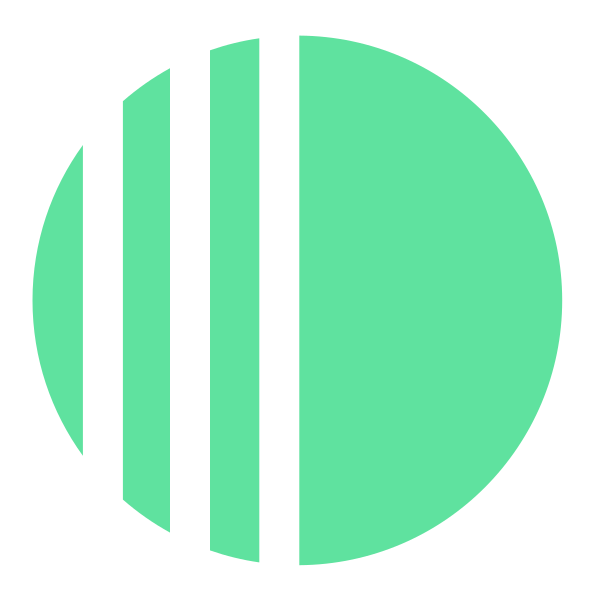

  
  
<strong>Discrete</strong>Documentation

- [Whitepaper](https://docs.discrete.cash/whitepaper/discrete-whitepaper.pdf)
- [Overview](/)

- **Consensus**
  - [DiscretePower](/consensus/pow.md)
  - [Mining security](/consensus/mining-security.md)
  - [Emission policy](/consensus/emission.md)
  - [Network identity](/consensus/network.md)
  - [Genesis](/consensus/genesis.md)
  - [On Fees](/consensus/pq-fees.md)
  - [Wire format](/consensus/pq-wire-format.md)

- **Operators**
  - [Node operation](/operators/node-operation.md)
  - [Mining](/operators/mining.md)
  - [Finality recovery](/operators/finality-recovery.md)

- **Wallets**
  - [Support matrix](/wallets/wallet-scope.md)
  - [Wallet behavior](/wallets/wallet-behavior.md)
  - [Payment proofs](/reference/payment-proof.md)
  - [PQ key capabilities](/wallets/pq-wallet-capabilities.md)
  - [walletd RPC](/wallets/walletd-rpc.md)
  - [simplewallet RPC](/wallets/simplewallet-rpc.md)
  - [Deposit addresses](/wallets/walletd-deposit-addresses.md)
  - [Exchange integration](/wallets/walletd-exchange-guide.md)

- **Reference**
  - [PQ ownership model](/reference/pq-ownership-model.md)
